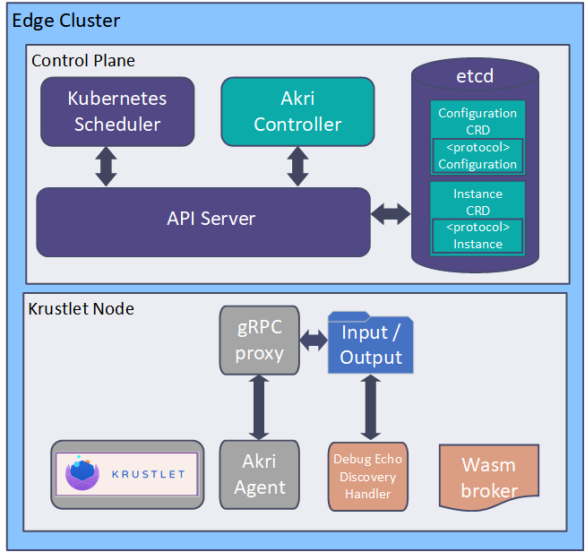

# Krustlet using Akri devices demo
This is a demo to showcase the usage of Akri discovered devices by a WebAssembly application running on Krustlet.

The architecture we are achieving at the end is shown below, a local running Akri Agent will communicate with Krustlet device plugin manager and allow the creation of the resources discovered by the Wasi Discovery Handler.



## Start your kubernetes cluster

For this demo we are using MicroK8s, but feel free to use any of your choice, Krustlet has documentation for most of them [here](https://github.com/deislabs/krustlet/tree/main/docs/howto).

## Start your Krustlet node

Krustlet has an automatic bootstrap process that gives the node the right authorizations to execute, you can find a tutorial for it [here](https://github.com/krustlet/krustlet/blob/main/docs/howto/bootstrapping.md).
For this demo we are using an unreleased version of Krustlet that enable the device plugin features. Because of that, we are running Krustlet directly from the main branch from GitHub using the command:

```
git clone https://github.com/krustlet/krustlet.git
cd krustlet
KRUSTLET_NODE_IP=127.0.13.1 \
	KRUSTLET_HOSTNAME=krustlet \
	KRUSTLET_NODE_NAME=krustlet \
	KRUSTLET_BOOTSTRAP_FILE={YOUR_BOOTSTRAP_FILE} \
	just run
```
> Make sure the Node IP informed is present on the known hosts list (Manually add it if not present).

## Apply Akri configurations

For making our cluster ready to receive the Akri Agent we should install some Akri configurations, this will include the CRDs used to connect with the Kubernetes node and also the Debug Echo configurations so the Agent can start the discovery of Debug Echo devices.

```
helm repo add akri-helm-charts https://deislabs.github.io/akri/
helm install debug-config akri-helm-charts/akri \
 --set controller.enabled=false \
 --set agent.enabled=false \
 --set rbac.enabled=false \
 --set debugEcho.configuration.enabled=true
```

## Start Akri Agent

To inform the Krustlet node about new resources and communication with the Discovery Handler we will now run the Akri Agent from Akri main branch. 

```
git clone https://github.com/deislabs/akri.git
cd akri
cargo build --release
RUST_LOG=info RUST_BACKTRACE=1 KUBECONFIG=~/.kube/config \
	DISCOVERY_HANDLERS_DIRECTORY=~/akri \
	AGENT_NODE_NAME=krustlet \
	HOST_CRICTL_PATH=/usr/local/bin/crictl \
	HOST_RUNTIME_ENDPOINT=/var/snap/microk8s/common/run/containerd.sock \
	HOST_IMAGE_ENDPOINT=/var/snap/microk8s/common/run/containerd.sock \
	./target/release/agent
```
> Note that it’s important to not run this as `sudo` and make sure Kube Config points to one with `admin` permissions (Krustlet bootstrap file does not work for this).
> Also note that since we have applied the Akri Debug Echo Configurations, the Agent is already trying to find a discovery handler for these specified devices.

## Start the gRPC proxy

The rest of this tutorial will be done from this repository.

Now that the Agent is running, we can start the discovery process. Once we run the gRPC proxy it will communicate with the Agent, informing its ready to start finding devices for that specific protocol.
The gRPC proxy does not do any discovery, it is responsible for informing the Wasi Discovery Handlers about current constraints and passing to the Agent the list of discovered devices it receives.

```
cargo build -p dh-grpc-proxy --release
RUST_LOG=info \
    DISCOVERY_HANDLER_NAME=debugEcho \
    DISCOVERY_HANDLERS_DIRECTORY=~/akri \
    AGENT_NODE_NAME=krustlet \
    ./target/release/dh-grpc-proxy
```
> Note that we are using the proxy to simulate a Debug Echo Discovery Handler, but it is a universal program and support any future DHs.

## Deploy Wasi Debug Echo

Now everything that should be running locally is already active, the rest of this demo will be focused on Kubernetes.
Now the gRPC proxy should have successfully connected with the Akri Agent and the input file was already written on the correct directory. The gRPC proxy is now waiting for the output file to be written by our WebAssembly application, we can deploy it now.

```
kubectl apply -f ./deployment/wasi_debug_echo.yaml 
```

## Checking the new resources

Now the Agent should have informed the Krustlet node about the new resources and are now advertised by the nodes. We can this out with the following command.

```
kubectl get akrii
```

## Requesting resources from Krustlet

Now that the devices are already been advertised as Kubernetes resources, we can deploy a WebAssembly module that request them.

```
kubectl apply -f ./deployment/wasm_pod_using_wde.yaml
```

## Conclusion

During this demo we have showcased the usage of devices discovered by a Wasm Discovery Handler by a Wasm module inside Krustlet. This allows us to now use Akri in the WebAssembly environment and new Discovery Handlers and usages can build up from that.
