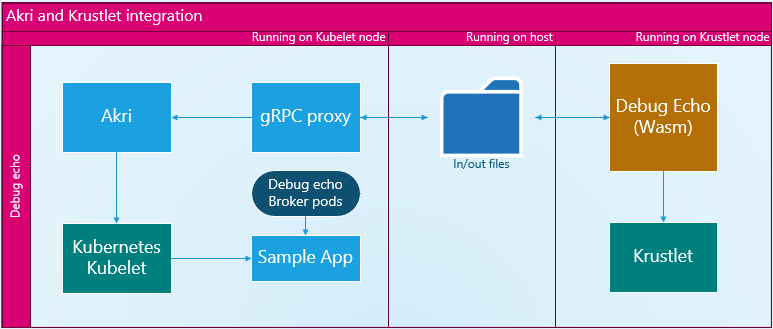

# Akri and Krustlet integration demo
This is a demo to showcase the usage of a Wasi Discovery Handler and integration with the regular container Akri components.

The architecture we are achieving at the end is shown above, the regular Akri deployments will be able to handle and use devices discovered by a WebAssembly Discovery Handler running on a Krustlet node.



## Start your kubernetes cluster

For this demo we are using microk8s, but feel free to use any of your choice, krustlet has documentation for most of them [here](https://github.com/deislabs/krustlet/tree/main/docs/howto).

## Start your krustlet node

This can be done following krustlet tutorials [here](https://github.com/deislabs/krustlet/blob/main/docs/intro/quickstart.md).

## Start Akri

Lets make our cluster ready for handleling the discovered devices and for this we are using Akri's Debug Echo configurations, more information can be found [here](https://github.com/deislabs/akri/blob/main/docs/debug-echo-configuration.md).

```
helm repo add akri-helm-charts https://deislabs.github.io/akri/
helm install akri akri-helm-charts/akri \
    --set agent.allowDebugEcho=true \
    --set debugEcho.discovery.enabled=true \
    --set debugEcho.discovery.image.repository=ghcr.io/rodz/grpc-proxy-discovery-handler \
    --set debugEcho.discovery.image.tag=v1 \
    --set debugEcho.configuration.enabled=true \
    --set debugEcho.configuration.shared=false
```

## Apply gRPC proxy configuration

If you log the debug echo pod you should see some errors, that’s because we haven't set up the correct volume mount. Since we are using files to communicate with the Wasi Debug Echo we need to make sure they are sharing the same storage on the machine.

```
microk8s kubectl apply -f ./deployment/gRPC_proxy.yaml 
```

## Deploy Wasi Debug Echo

Now the gRPC proxy should have successfully connected with the Akri's Agent and the input file was already written on the correct directory. The gRPC proxy is now waiting for the output file to be written by our WebAssembly application, we can deploy it now.

```
microk8s kubectl apply -f ./deployment/wasi_debug_echo.yaml 
```

## Checking the broker pods

Now we can check if the Debug Echo broker pods have been created successfully and even create a pod requesting these devices as resources.

```
watch microk8s kubectl get pods,akric,akrii,services -o wide
```

## Conclusion

During this demo we have showcased the usage of devices discovered by a WebAssembly Discovery Handler in the container infrastructure of Akri. This allows us to create new discovery handlers using this technology.
